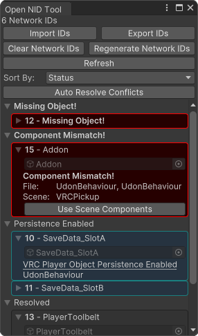
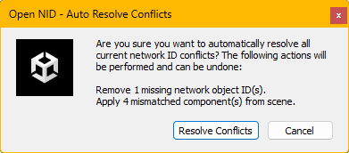
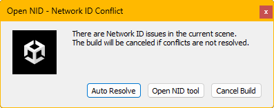
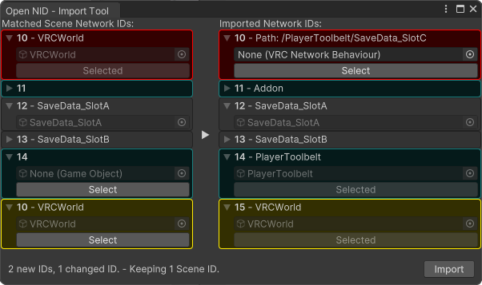
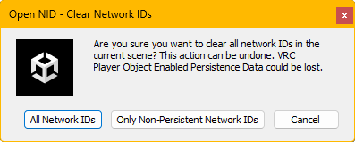
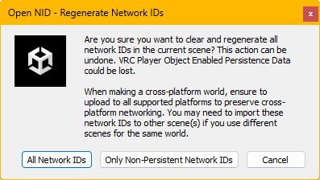

# Install
Install the VPM package <b>[here](https://bobystar.github.io/OpenNID/)</b> or via the Unity Package in [Releases](https://github.com/BobyStar/OpenNID/releases/latest). 
Open the main window in the Unity Editor Menu: `Tools/Open NID`.
# Open NID
An open source utility tool to easily manage Network IDs for VRChat worlds. 

# Features
## Automatic Conflict Resolution
Open NID provides simple auto fixes for tedious actions like reapplying scene components to an existing network object and 
clearing missing network objects from the collection. This is helpful when needing to do repeated builds with scene changes for testing. 

## Automatic Build Check
Open NID hooks into the VRChat SDK Build API and allows the user to fix issues before the Network ID Verification process. 

## Import/Export Tool
Open NID provides an intuitive export and import tool for transferring Network ID information between scenes and projects. 

## Player Object Enabled Persistence Aware
Open NID checks for network behaviours related to VRC Player Objects w/VRC Enable Persistence components to allow operations like Clear and Regenerate Network IDs to exclude persistence enabled Network IDs. 

## Undo/Redo Support
Most actions done with Open NID support Unity's Undo system and Prefab instance modifications.
# Support
Found a bug? Report it [here](https://github.com/BobyStar/OpenNID/issues)! 
Want to support the tool? Share it with others and make a contribution to the codebase!
